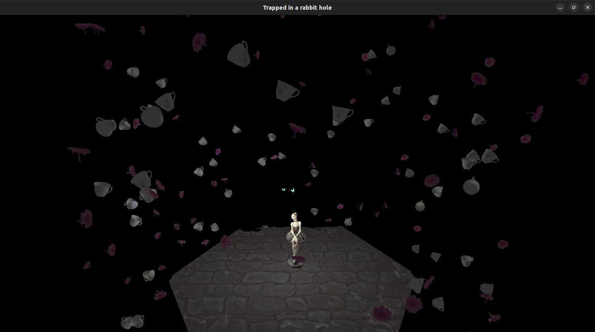
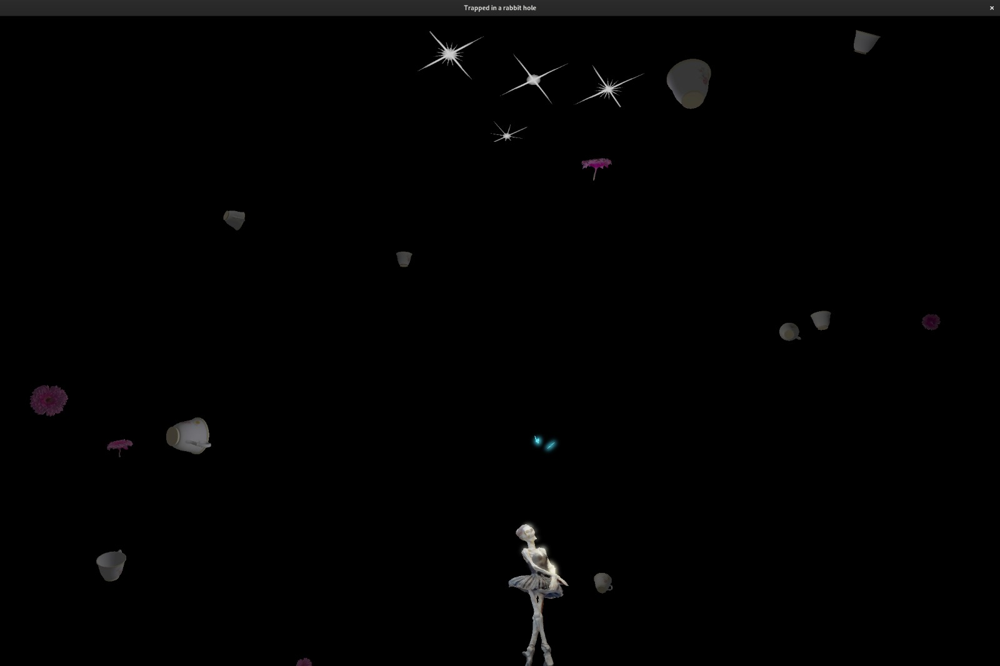
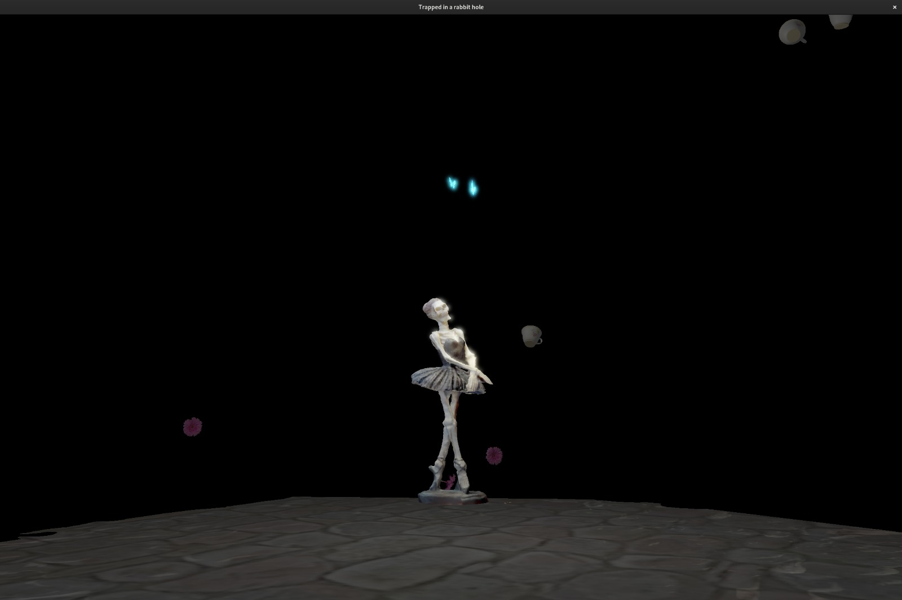

# RG Projekat 
___
Projekat *Trapped in a rabbit hole* rađen na predmetu račnarska grafika.

U okviru projekta implementirani su:  
+ Instancing 
+ Normal mapping, Parallax mapping
+ HDR, Bloom

## Uputstvo
___
`git clone https://github.com/amijovic/rg-matf.git`  
CLion -> Open -> path/to/my/project_base   
ALT+SHIFT+F10 -> project_base -> run  

## Komande
___
`ESC` - prekid programa  
`WASD` - kretanje  
`B` - Bloom  
`H` - HDR  
`Q` - decrese exposure  
`E` - increse exposure  

## Resursi
___
Skelet projekta preuzet je sa adrese: https://github.com/matf-racunarska-grafika/project_base  
Svi modeli preuzeti su sa: https://sketchfab.com/feed  
[Balerina](https://sketchfab.com/3d-models/scaniverse-ballerina-skeleton-a67a2e8d5b4646b1ab70d1f8decfe7eb),
[Leptir](https://sketchfab.com/3d-models/animated-butterfly-d4fbcbaab845402999f30c5aa75851e6), 
[Cvet](https://sketchfab.com/3d-models/gerbera-anatomy-african-daisy-scan-a65855b3fd0a4eb6bbd30cad5a6e3c5d),
[Solja](https://sketchfab.com/3d-models/tea-cup-93f3386eb6f34bb8acb5caa3645e9070)  
[Tekstura](https://www.stickpng.com/img/nature/light/white-sparkles) koriscena za blending.  

## Galerija
___

---
Profesor: Vesna Marinković  
Asistent: Marko Spasić  
Ana Mijović, 59/2021